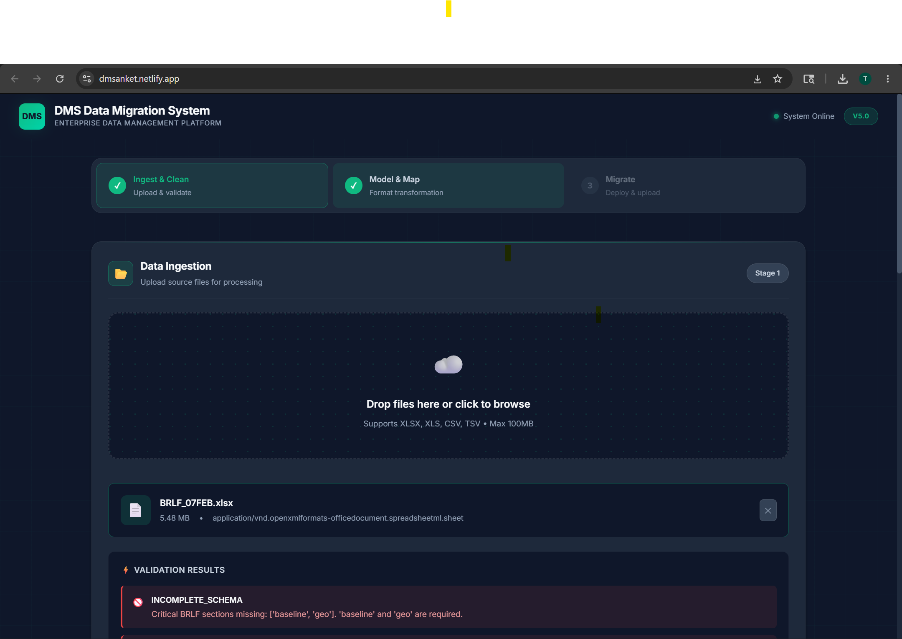
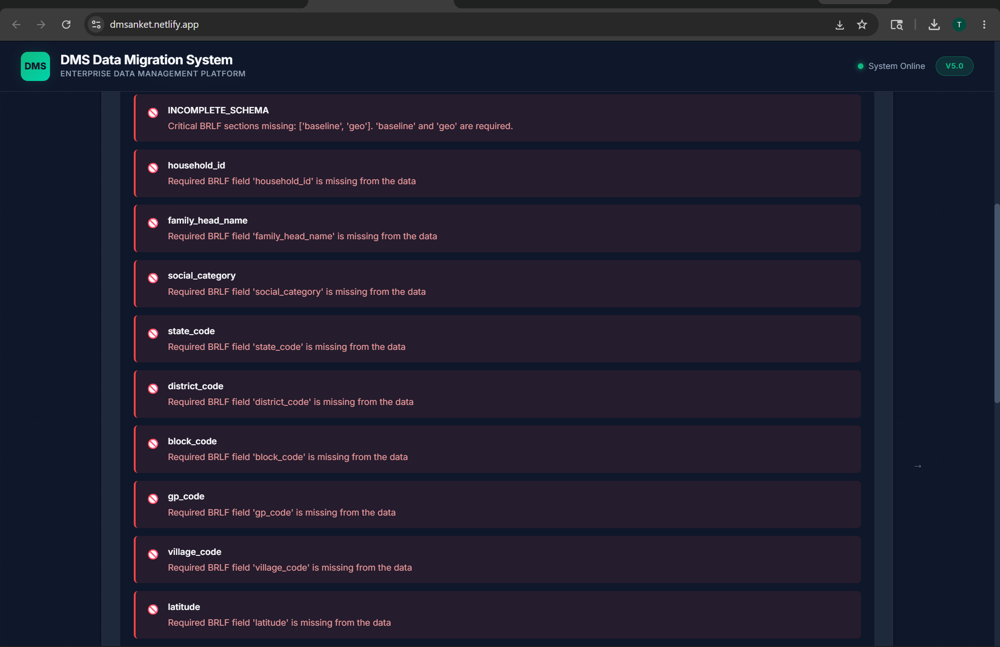
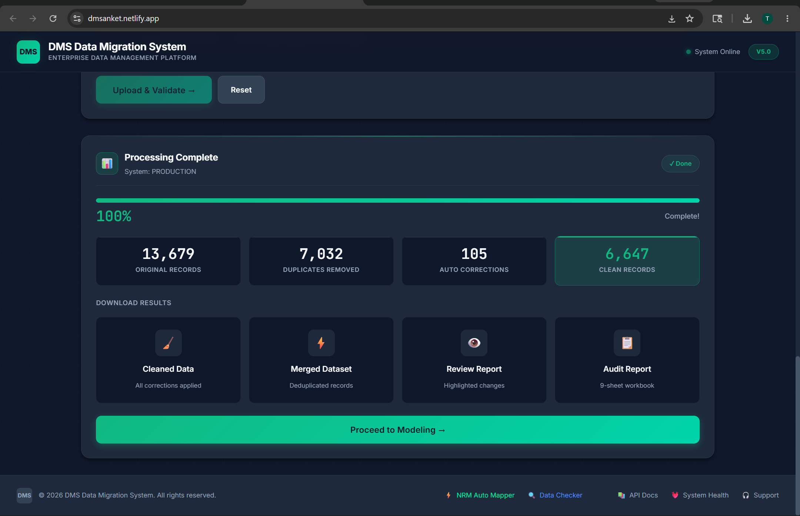
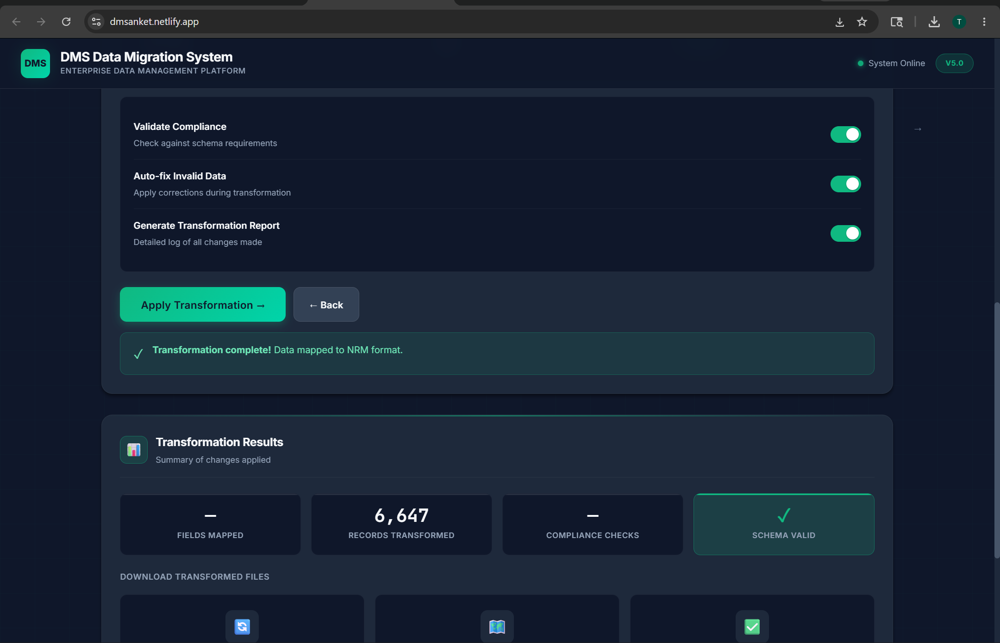
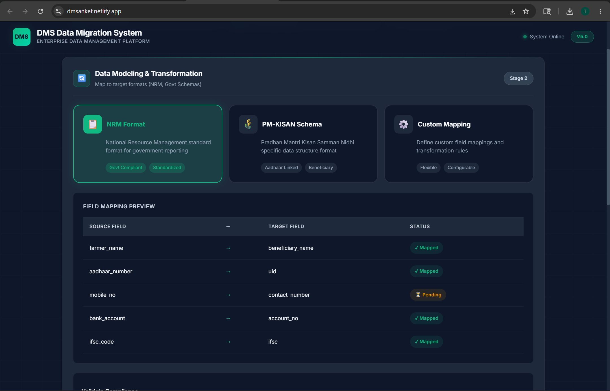
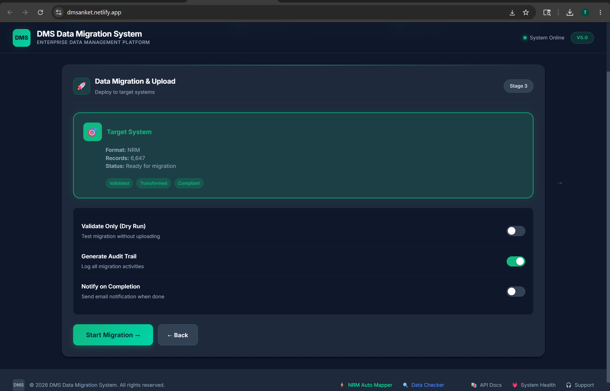
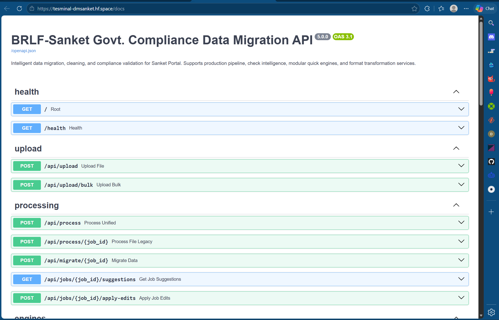

# BRLF-SANKET GOVT. COMPLIANCE DATA MIGRATION SYSTEM

**Enterprise-grade web-based data migration, cleaning, and compliance validation for Sanket Portal**

---
## How to use APPLICATION: GO TO https://dmsanket.netlify.app/ or search on Google: https://dmsanket.netlify.app/
                          Three steps are given:  Data Ingestion --> Model& Map --> Migrate
                          
                          Ingestion: upload files and processing --> Next to Modeling and mapping with selective advisory, all according to user inputs --> 
                          
                          Migrate                          
                         
                         
<p align="center">







</p>

## ⚡ QUICK START local Environment (5 Minutes)

```bash
# 1. Make sure Docker is running (whale icon visible)

# 2. Copy environment config
cp .env.example .env

# 3. Start the system
docker compose up -d

# 4. Open browser
http://localhost:3000

# ✅ Done! The system is ready to use
```

---

## 📚 DOCUMENTATION

**New to Docker?** → Read `docs/COMPLETE_BEGINNER_GUIDE.md` (Step-by-step with explanations)

**Quick reference?** → Read `docs/DOCKER_FOR_BEGINNERS.md` (Command reference)

**Security policy?** → Read `SECURITY.md`

---

## 🎯 WHAT THIS SYSTEM DOES

- ✅ Remove duplicate records (unlimited file size)
- ✅ AI-powered gender/category correction (95% accuracy)
- ✅ Sanket Portal compliance validation
- ✅ Multiple processing modes (Production, Global, Advisory, Selective)
- ✅ Quick engines for individual data operations
- ✅ Detailed 9-sheet audit reports
- ✅ Admin file routing and gender library management
- ✅ Automatic backups
- ✅ Multi-user web access

---

## 🏗️ ARCHITECTURE

```
┌─────────────────────────────────────────────────────────┐
│                    Frontend (React)                      │
│              nginx :3000 → /api → backend               │
└──────────────────────┬──────────────────────────────────┘
                       │
┌──────────────────────▼──────────────────────────────────┐
│                  Backend (FastAPI)                        │
│                                                          │
│  ┌──────────────┐  ┌──────────────┐  ┌──────────────┐  │
│  │  Production   │  │    Check     │  │    Quick     │  │
│  │   Pipeline    │  │ Intelligence │  │   Engines    │  │
│  └──────────────┘  └──────────────┘  └──────────────┘  │
│                                                          │
│  ┌──────────────┐  ┌──────────────┐                     │
│  │ Admin: File   │  │ Admin: Gender│                     │
│  │  Routing      │  │  Library     │                     │
│  └──────────────┘  └──────────────┘                     │
└─────────────────────────────────────────────────────────┘
```

---

## 📁 FOLDER STRUCTURE

```
dmsanket/
├── backend/               # Python FastAPI backend
│   ├── api/              # Unified API (main.py)
│   ├── engines/          # Quick engines (name, contact, duplicate, gender)
│   ├── validators/       # Data validators
│   ├── check_intelligence/  # Check Intelligence system
│   ├── gender_lib/       # Gender library
│   └── dockerfiles/      # Docker configs
├── frontend/              # React web interface
│   ├── src/              # Source code (App.js, App.css)
│   ├── nginx.conf        # Production nginx with security headers
│   └── Dockerfile        # Multi-stage build
├── data/                  # YOUR DATA
│   ├── uploads/          # Temp uploads
│   ├── outputs/          # ✅ CLEANED FILES HERE
│   ├── backups/          # Original backups
│   └── reports/          # Detailed reports
├── docs/                  # Full documentation
├── .env.example           # Environment config template
├── .gitignore             # Git ignore rules
├── SECURITY.md            # Security policy
├── docker-compose.yml     # Main Docker config
└── README.md              # This file
```

---

## 🛠️ COMMON COMMANDS

```bash
# Start system
docker compose up -d

# Stop system
docker compose down

# Check status
docker ps

# View logs
docker compose logs -f

# Restart
docker compose restart

# Start in dev mode (hot reload)
docker compose --profile dev up
```

---

## 🌐 ACCESS

- **Web Interface:** https://dmsanket.netlify.app

- **API Docs:** https://tesminal-dmsanket.hf.space/docs

---

## 🔒 SECURITY

- Configurable CORS whitelist (not wildcard `*`)
- Upload size limits (default: 100 MB)
- Path traversal protection on downloads
- Content Security Policy (CSP) headers
- Non-root Docker user
- Input validation and sanitization
- See `SECURITY.md` for vulnerability reporting

---

## 📊 PROVEN RESULTS

Tested with real KVGPS data:
- Input: 12,106 records
- Removed: 7,397 duplicates
- AI fixes: 41 gender corrections (100% accurate)
- Output: 4,709 clean records
- Time: < 3 seconds
- Sanket compliance: 100% ✅

---

## ✅ SYSTEM REQUIREMENTS

- Docker Desktop installed
- 8 GB RAM (recommended)
- 10 GB free disk space
- Windows 10/11, macOS 10.15+, or Ubuntu 20.04+

---

## 🆘 TROUBLESHOOTING

**Problem:** Website not loading, server error, do process again 
**Fix:** Wait 30 seconds after starting, then refresh the browser

**Problem:** Docker not found
**Fix:** Install Docker Desktop from https://www.docker.com

**Problem:** Port already in use
**Fix:** Edit `.env` or docker-compose.yml, change port mapping

**More help:** See `docs/COMPLETE_BEGINNER_GUIDE.md` troubleshooting section

---

**BRLF — Sanket Portal Govt. Compliance Migration System v4.1**
*Intelligent, Accurate, Secure, Production-Ready*
